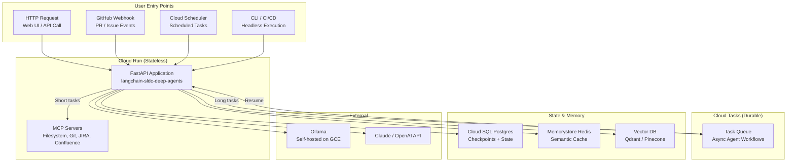

# Architecture: langchain-sldc-deep-agents

## High-Level Overview

---

## Component Details

### 1. Infrastructure Layer (Hybrid)

| Environment | Description |
| :--- | :--- |
| **Local** | Docker Compose with Ollama, Postgres, Redis, Qdrant, and MCP mocks. |
| **CI/CD** | GitHub Actions or Bitbucket Pipelines running headless Docker containers. |
| **Staging** | GCP Cloud Run with Cloud SQL, Memorystore, and Qdrant Cloud. |
| **Production** | GCP Cloud Run (scaled) with Cloud SQL (HA), Memorystore, and Qdrant Cloud (production tier). |

### 2. State Management

- **Checkpoints**: LangGraph's `PostgresSaver` stores state snapshots.
- **Thread Isolation**: Each session uses a unique `thread_id` for multi-tenancy.
- **In-Memory Mode**: SQLite (`sqlite:///memory.db`) is used in CI/CD for speed.

### 3. Tool Abstraction (MCP)

- **MCPToolRegistry**: Dynamically loads MCP servers from `agents.yaml`.
- **Transports**: Supports `stdio` (local/CI) and `http` (network) transports.
- **Tool Filtering**: Nodes only receive the tools they explicitly request in YAML.

### 4. Dynamic Graph Compilation

| Component | Responsibility |
| :--- | :--- |
| **NodeFactory** | Reads `agents.yaml` -> renders Jinja2 prompts -> binds tools -> returns callable async function. |
| **GraphBuilder** | Programmatically adds nodes, edges, and conditional branches to LangGraph. |
| **Condition Registry** | Maps Python function names (e.g., `quality_threshold`) to YAML references. |

### 5. CI/CD Entrypoints

- **CLI Mode**: `app/cli.py` runs headlessly, outputs JSON to stdout.
- **Exit Codes**: `0` = success (review score >= 60), `1` = failure.
- **Pipeline Integration**: GitHub Actions and Bitbucket Pipelines run the CLI container.

### 6. Contextual Ingestion

- **Entry Point**: `context_loader` node is the first node in the graph.
- **Data Sources**: Fetches from GitHub Issues, JIRA tickets, Confluence pages, etc.
- **State Hydration**: Populates `state["external_context"]` before the Planner runs.

---

## Key Data Flows

### Happy Path (PR Review)

1. Developer opens a PR.
2. GitHub webhook hits Cloud Run endpoint.
3. Cloud Run returns `200 OK` and enqueues a Cloud Task.
4. Cloud Task runs the LangGraph agent.
5. Agent fetches PR diff via GitHub MCP server.
6. Agent analyzes code and posts review comments.
7. Agent updates PR status.

### Long-Running Task (Async HITL)

1. User invokes agent via API.
2. Agent reaches `human_approval` node.
3. Graph interrupts and enqueues a Cloud Task.
4. Cloud Run instance scales to zero (saving cost).
5. Human approves via web dashboard.
6. Cloud Task resumes the graph from the checkpoint.
7. Agent continues execution.

---

## Security Architecture

| Layer | Security Measure |
| :--- | :--- |
| **Network** | Private VPC, Cloud Run uses internal load balancer. |
| **Authentication** | OIDC for Cloud Tasks, IAM for Cloud Run, GitHub token for webhooks. |
| **Secrets** | GCP Secret Manager for API keys, GitHub Secrets for CI. |
| **Sandbox** | Shell commands run in restricted directory (`/workspace`). Path traversal prevented. |
| **Audit** | All agent actions logged to Cloud Logging with structured logs. |

---

## Performance Considerations

| Concern | Mitigation |
| :--- | :--- |
| **Cold Starts** | Cloud Run minimum instances = 1 for production. |
| **Token Costs** | Semantic caching (Redis) + fallback to Ollama for simple tasks. |
| **Long Contexts** | Summarizer node compresses state before hitting LLM. |
| **Concurrency** | Cloud Run scales to 10 concurrent requests per instance. |
| **Tool Timeouts** | 30-second timeout per MCP tool call, retry with exponential backoff. |